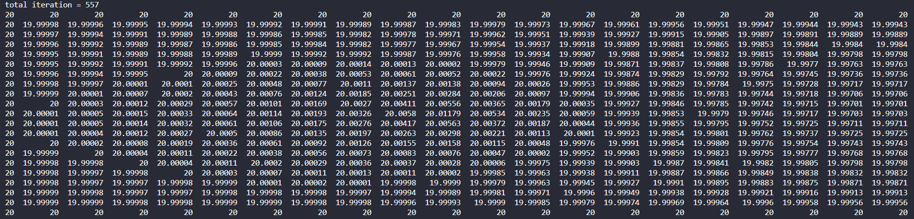
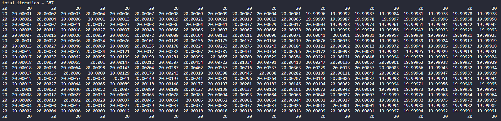

# Homework 5  
00957016 高敬庭  
## Solution
+ Epsilon = 0.0001, grid-resolution = 21 * 21, BC = 20, derivative val = 0, source val = 10  
  + w = 1.0  
   
  + w = 1.2  
     

    ||w = 1.0|w = 1.2|
    |---|---|---|
    |iteration|557|387|  

## Different Boundary conditions  
+ **w = 1.0**, Epsilon = 0.0001, grid-resolution = 21 * 21, derivative val = 0, source val = 10  
  ||BC = 10|BC = 20|BC = 30|BC = 40|BC = 50|
  |---|---|---|---|---|---|
  |iteration|511|557|584|602|617|  

+ **w = 1.2**, Epsilon = 0.0001, grid-resolution = 21 * 21, derivative val = 0, source val = 10  
  ||BC = 10|BC = 20|BC = 30|BC = 40|BC = 50|
  |---|---|---|---|---|---|
  |iteration|356|387|404|417|427|  

從上表可看出，在其他條件相同的情況下，Boundary Condition越小計算所需的Iteration次數也越少。

## Different Source terms  
+ **w = 1.0, BC = 20**, Epsilon = 0.0001, grid-resolution = 21 * 21, derivative val = 0  
  ||SRC = 10|SRC = 20|SRC = 30|SRC = 40|SRC = 50|
  |---|---|---|---|---|---|
  |iteration|557|557|557|557|557|
  |T[1][1]|19.99998|20.00006|20.00013|20.00021|20.00028|  

+ **w = 1.2, BC = 20**, Epsilon = 0.0001, grid-resolution = 21 * 21, derivative val = 0  
  ||SRC = 10|SRC = 20|SRC = 30|SRC = 40|SRC = 50|
  |---|---|---|---|---|---|
  |iteration|387|387|387|387|387|
  |T[1][1]|20.00001|20.00008|20.00016|20.00023|20.00031|    

從上表可看出，在其他條件相同的情況下，Source term的大小並不影響收斂速度，但是計算出來的結果會隨著Source term變大而隨之增加(以T[1][1]為例)。

## Different w for SOR Method  
+ 表格內數字代表需多少iteration才收斂
  |w\gridSize|11\*11|21\*21|31\*31|41\*41|51\*51|
  |---|---|---|---|---|---|
  |1.0|164|557|1130|1855|2715|
  |1.05|149|509|1035|1701|2492|
  |1.1|136|465|947|1559|2286|
  |1.15|123|424|866|1427|2094|
  |1.2|112|387|790|1304|1916|
  |1.25|101|351|719|1189|1749|
  |1.3|91|318|653|1081|1592|
  |1.35|81|287|591|979|1444|
  |1.4|72|258|532|883|1304|
  |1.45|63|230|476|792|1171|
  |1.5|54|203|423|706|1044|
  |1.55|45|178|372|623|924|
  |1.6|35|153|324|544|808|
  |1.65|**32**|129|277|467|697|
  |1.7|41|105|232|394|589|
  |1.75|45|80|187|321|484|
  |1.8|61|**63**|141|250|381|
  |1.85|81|82|**89**|176|276|
  |1.9|121|122|125|**134**|**159**|
  |1.95|243|244|242|243|251|

可以看到從1.0開始慢慢往上增加w的數值確實可以降低所需要的iteration，但是一旦超過最佳w後又會升高。

## Best w for each resolution  
  ||11\*11|21\*21|31\*31|41\*41|51\*51|
  |---|---|---|---|---|---|
  |best w|1.65|1.8|1.85|1.9|1.9|